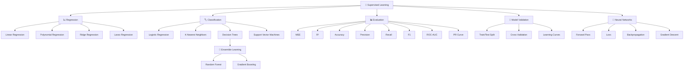
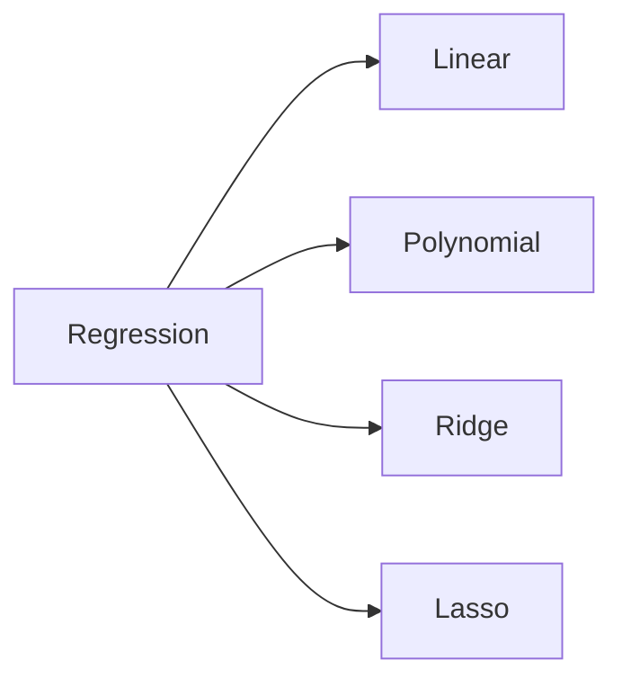
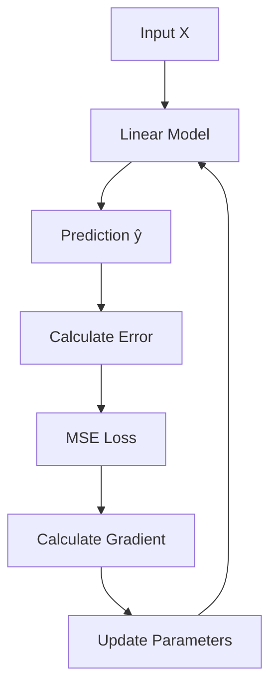
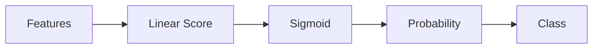
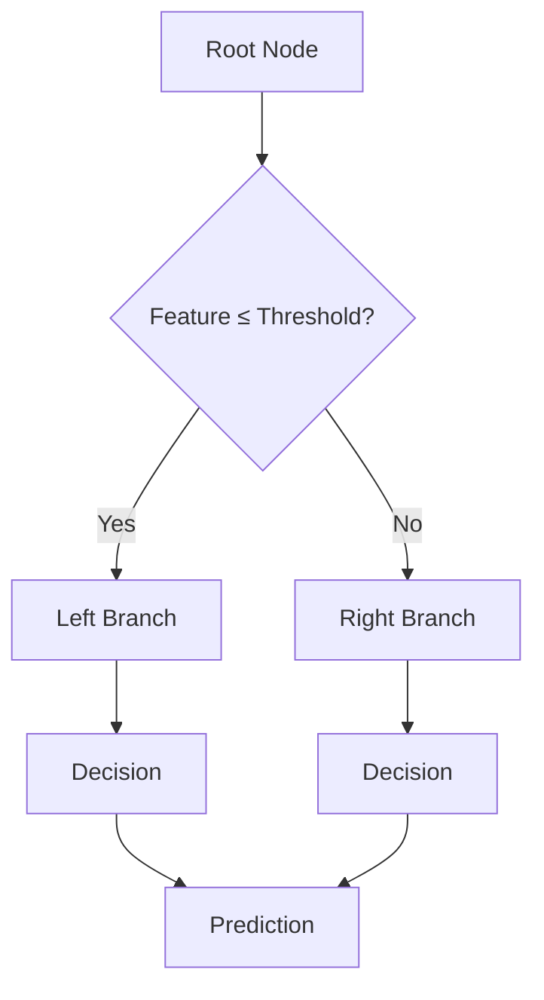
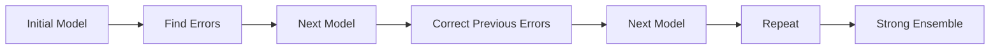
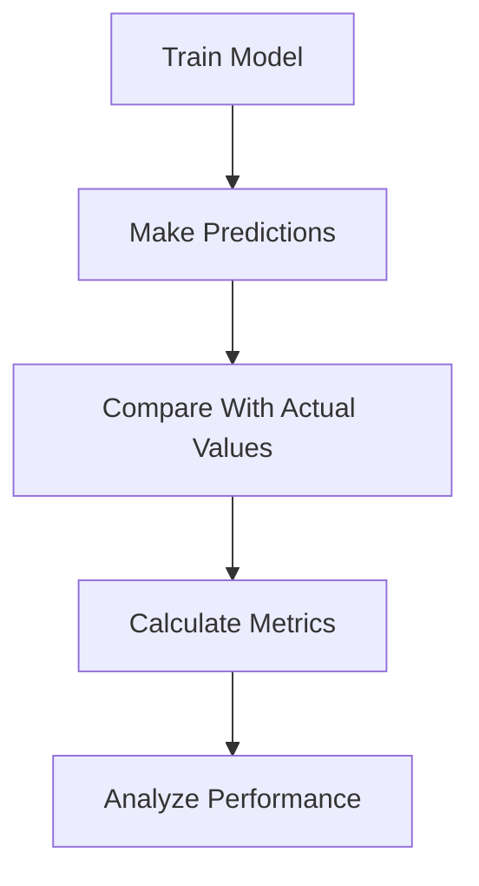
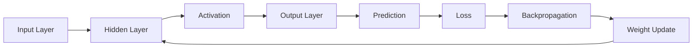
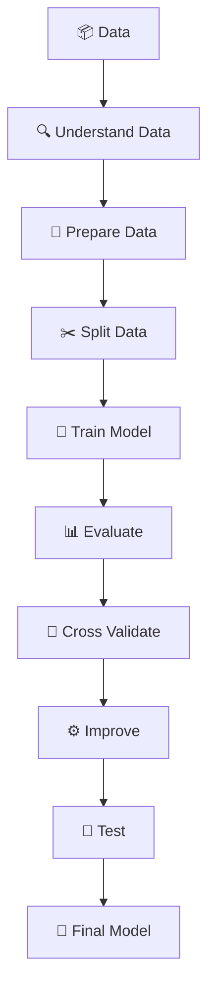

# 🧠 Supervised Machine Learning — From Basics to Advanced

> **A complete, self-contained walkthrough of Supervised Machine Learning — covering intuition, mathematics, from-scratch implementations, Scikit-Learn implementations, visualizations, and model evaluation.**

## 🚀 Overview

This repository contains a complete Jupyter Notebook for learning **Supervised Machine Learning from fundamentals to advanced concepts**.

The notebook is designed around five stages for every major topic:

```text
        🧠 CONCEPT
            ↓
       💡 INTUITION
            ↓
       📐 MATHEMATICS
            ↓
     💻 IMPLEMENTATION
       ↙          ↘
 FROM SCRATCH   SCIKIT-LEARN
       ↘          ↙
       📊 VISUALIZATION
            ↓
       📈 EVALUATION
```

The goal is to understand not only **how to use an algorithm**, but also **why it works and what happens internally**.

---

# 🗺️ Complete Learning Roadmap



---

# 📚 Table of Contents

* [What Is Supervised Learning?](#-what-is-supervised-learning)
* [Regression](#-regression)
* [Linear Regression](#-linear-regression)
* [Polynomial Regression](#-polynomial-regression)
* [Ridge Regression](#-ridge-regression)
* [Lasso Regression](#-lasso-regression)
* [Logistic Regression](#-logistic-regression)
* [K-Nearest Neighbors](#-k-nearest-neighbors)
* [Decision Trees](#-decision-trees)
* [Random Forest](#-random-forest)
* [Gradient Boosting](#-gradient-boosting)
* [Support Vector Machines](#-support-vector-machines)
* [Model Evaluation](#-model-evaluation)
* [Cross Validation](#-cross-validation)
* [Learning Curves](#-learning-curves)
* [Neural Networks](#-neural-networks)
* [Technologies](#-technologies)
* [Getting Started](#-getting-started)
* [Learning Philosophy](#-learning-philosophy)

---

# 🧠 What Is Supervised Learning?

Supervised learning works with a dataset containing:

* **Features `X`**
* **Known target `y`**

The model learns a function that maps the input features to the target.

```text
             TRAINING DATA

        Features X       Target y
       ┌────────────┐   ┌─────────┐
       │ x₁ x₂ x₃   │   │   y     │
       │ x₁ x₂ x₃   │   │   y     │
       │ x₁ x₂ x₃   │   │   y     │
       └────────────┘   └─────────┘
              │             │
              └──────┬──────┘
                     ↓
                🤖 MODEL
                     ↓
              Learn fθ(x)
                     ↓
              New Unseen X
                     ↓
                Prediction ŷ
```

The notebook distinguishes between:

### 📈 Regression

Predicts a continuous value.

```text
Price
  ↑
  │       ●
  │    ●
  │  ●
  │ ●
  └──────────────→ Feature
```

Example:

```text
House Features → House Price
```

### 🏷️ Classification

Predicts a discrete class.

```text
Input
  │
  ↓
Classifier
  │
  ├── Class 0
  │
  └── Class 1
```

Example:

```text
Email → Spam / Not Spam
```

---

# 📈 Regression

Regression models predict numerical values.

The notebook covers:



---

# 📉 Linear Regression

Linear Regression models the relationship between features and a continuous target.

### Model

$$
\hat{y} = f_\theta(x)
$$

For multiple features:

$$
\hat{y}
=
\theta_0+
\theta_1x_1+
\theta_2x_2+
\dots+
\theta_dx_d
$$

### Loss Function

The notebook uses **Mean Squared Error**:

$$
J(\theta)
=
\frac{1}{2n}
\sum_{i=1}^{n}
(\theta^Tx^{(i)}-y^{(i)})^2
$$

### Learning Process



### Normal Equation

The notebook also covers the closed-form solution:

$$
\theta=(X^TX)^{-1}X^Ty
$$

### Gradient Descent

$$
\nabla_\theta J
=
\frac{1}{n}X^T(X\theta-y)
$$

Then:

$$
\theta
\leftarrow
\theta-\alpha\nabla_\theta J
$$

where `α` is the learning rate.

---

# 🌀 Polynomial Regression

Polynomial Regression allows a linear model to represent nonlinear relationships.

```text
Linear Relationship

     /
    /
   /
  /
 /

        ↓

Polynomial Relationship

       ●
     ●
   ●
 ●
●
```

The notebook explores polynomial feature transformation and how increasing model complexity can lead to:

```text
Underfitting
     ↓
Good Fit
     ↓
Overfitting
```

---

# 🛡️ Ridge Regression

Ridge Regression adds **L2 regularization** to the objective.

```text
Normal Regression
       │
       ↓
Large Weights
       │
       ↓
Potential Overfitting

          +

     L2 Penalty
          │
          ↓
Smaller Weights
          │
          ↓
Better Generalization
```

Conceptually:

$$
Loss + \lambda\sum_j\theta_j^2
$$

---

# ✂️ Lasso Regression

Lasso uses **L1 regularization**.

```text
Feature Weights

w₁  ████████
w₂  █████
w₃  ██
w₄  ██████

       ↓
     LASSO
       ↓

w₁  █████
w₂  ███
w₃  0
w₄  ████
```

Because some weights can become exactly zero, Lasso can also perform a form of **feature selection**.

---

# 🏷️ Logistic Regression

Logistic Regression is used for classification.

Instead of directly predicting an unrestricted numerical value, it converts a score into a probability.

### Sigmoid Function

$$
\sigma(z)=
\frac{1}{1+e^{-z}}
$$

```text
Probability
1.0 ┤             ●●●
    │          ●●
0.5 ┤──────●●────────────
    │    ●
0.0 ┤ ●●
    └──────────────────→ z
```

### Pipeline



---

# 👥 K-Nearest Neighbors

KNN predicts using nearby examples.

```text
        🟢
    🟢       🟢

             ⭐
          New Point

       🔵     🔵
```

The algorithm:

```text
New Data Point
      ↓
Calculate Distances
      ↓
Find K Nearest Points
      ↓
Look at Their Labels
      ↓
Majority Vote
      ↓
Prediction
```

Important concept:

> The choice of `K` controls the complexity of the model.

Small `K`:

```text
More flexible
     ↓
Higher variance
```

Large `K`:

```text
More stable
     ↓
Higher bias
```

---

# 🌳 Decision Trees

Decision Trees learn a sequence of decisions.



The notebook covers concepts such as:

* Gini impurity
* Entropy
* Information gain
* Splitting
* Tree depth
* Overfitting

---

# 🌲 Random Forest

Random Forest combines multiple decision trees.

```text
                 Dataset
                    │
       ┌────────────┼────────────┐
       ↓            ↓            ↓
    🌳 Tree 1    🌳 Tree 2    🌳 Tree 3
       │            │            │
       ↓            ↓            ↓
   Prediction   Prediction   Prediction
       │            │            │
       └────────────┼────────────┘
                    ↓
             Voting / Average
                    ↓
             Final Prediction
```

The main idea is:

> Many diverse trees can work together to produce a stronger prediction.

---

# ⚡ Gradient Boosting

Gradient Boosting builds models sequentially.



Instead of building independent trees like a traditional bagging approach, boosting builds models that progressively improve the ensemble.

---

# 🎯 Support Vector Machines

SVM searches for a decision boundary with a large margin between classes.

```text
Class A

 ● ● ●

        ┌─────────────┐
        │   Margin    │
        └─────────────┘

──────── Decision Boundary ────────

        ┌─────────────┐
        │   Margin    │
        └─────────────┘

 × × ×

Class B
```

Important concepts include:

* Hyperplane
* Margin
* Support vectors
* Soft margin
* `C`
* Kernel methods

---

# 📊 Model Evaluation

Training a model is only half the job.



---

## 📈 Regression Metrics

### Mean Squared Error

$$
MSE =
\frac{1}{n}
\sum(y-\hat y)^2
$$

### R² Score

The notebook uses regression evaluation including:

* Mean Squared Error
* R² Score

---

# 📊 Classification Metrics

The notebook covers:

* Accuracy
* Precision
* Recall
* F1 Score
* Confusion Matrix
* ROC Curve
* AUC
* Precision-Recall Curve

---

## 🔲 Confusion Matrix

```text
                    Predicted
                  0          1

Actual 0        TN         FP

Actual 1        FN         TP
```

### Accuracy

$$
Accuracy =
\frac{TP+TN}
{TP+TN+FP+FN}
$$

### Precision

$$
Precision =
\frac{TP}
{TP+FP}
$$

### Recall

$$
Recall =
\frac{TP}
{TP+FN}
$$

### F1 Score

$$
F1 =
2
\frac{Precision \times Recall}
{Precision + Recall}
$$

---

# 📈 ROC Curve

The notebook also visualizes ROC curves and calculates AUC.

```text
TPR
 ↑
1│          ●●●
 │       ●
 │     ●
 │   ●
 │ ●
0└──────────────────→ FPR
  0                1
```

ROC analysis helps evaluate classification performance across different thresholds.

---

# 🔄 Cross Validation

The notebook includes cross-validation to estimate model performance more reliably.

```text
Dataset

┌────┬────┬────┬────┬────┐
│ F1 │ F2 │ F3 │ F4 │ F5 │
└────┴────┴────┴────┴────┘

Round 1 → F1 Test
Round 2 → F2 Test
Round 3 → F3 Test
Round 4 → F4 Test
Round 5 → F5 Test

             ↓

      Average Performance
```

This helps avoid relying on a single train/test split.

---

# 📚 Learning Curves

Learning curves help understand whether a model is suffering from:

* Underfitting
* Overfitting
* High bias
* High variance

```text
Error
 ↑
 │\
 │ \
 │  \        Validation
 │   \______
 │
 │──────────── Training
 │
 └────────────────→
       Data Size
```

---

# 🧠 Neural Networks

The notebook also goes beyond traditional machine-learning algorithms and introduces a neural network implementation.

The neural-network section includes:

* Forward propagation
* Activation
* Loss
* Backpropagation
* Gradient-based learning
* Weight updates

---

## 🔗 Neural Network Architecture



---

## 🔁 Neural Network Learning Loop

```text
        Input
          ↓
    Forward Pass
          ↓
      Prediction
          ↓
        Loss
          ↓
   Backpropagation
          ↓
      Gradients
          ↓
    Update Weights
          ↓
       Repeat
```

The notebook includes a **from-scratch neural network implementation**, followed by testing and evaluation.

---

# 🧩 Complete ML Pipeline

All the topics ultimately connect into one machine-learning workflow.



---

# 🛠️ Libraries Used

The notebook imports and uses the Python data-science and machine-learning ecosystem:

```text
🐍 Python
 │
 ├── NumPy
 │   └── Numerical Computing
 │
 ├── Pandas
 │   └── Data Manipulation
 │
 ├── Matplotlib
 │   └── Visualization
 │
 ├── Seaborn
 │   └── Statistical Visualization
 │
 └── Scikit-Learn
     ├── Data Splitting
     ├── Preprocessing
     ├── Regression
     ├── Classification
     ├── Metrics
     ├── Cross Validation
     └── Learning Curves
```

---

# 📂 Repository Structure

```text
📦 supervised-machine-learning
│
├── 📓 supervised_ml_basics_to_advanced.ipynb
│
└── 📄 README.md
```

---

# ⚙️ Installation

Clone the repository:

```bash
git clone <your-repository-url>
```

Move into the project:

```bash
cd supervised-machine-learning
```

Install the required libraries:

```bash
pip install numpy pandas matplotlib seaborn scikit-learn jupyter
```

Start Jupyter:

```bash
jupyter notebook
```

Then open:

```text
supervised_ml_basics_to_advanced.ipynb
```

---

# 🎓 Learning Philosophy

This notebook follows a simple philosophy:

```text
             DON'T JUST USE ML
                    │
                    ↓
             UNDERSTAND ML
                    │
          ┌─────────┼─────────┐
          ↓         ↓         ↓
       Intuition   Math      Code
          │         │         │
          └─────────┼─────────┘
                    ↓
             Visualization
                    ↓
               Evaluation
                    ↓
             Real Understanding
```

Each section follows the structure:

```text
1️⃣ Concept & Intuition
        ↓
2️⃣ Mathematics
        ↓
3️⃣ From-Scratch Implementation
        ↓
4️⃣ Scikit-Learn Implementation
        ↓
5️⃣ Visualization
        ↓
6️⃣ Evaluation
```

---

# 🏆 What You'll Gain

After completing the notebook, you will have worked through the major foundations of supervised machine learning:

```text
                 SUPERVISED ML
                      │
       ┌──────────────┴──────────────┐
       ↓                             ↓
   REGRESSION                  CLASSIFICATION
       │                             │
   Linear                       Logistic
   Polynomial                   KNN
   Ridge                        Decision Tree
   Lasso                        SVM
       │                             │
       └──────────────┬──────────────┘
                      ↓
                  ENSEMBLES
                      │
              Random Forest
              Gradient Boosting
                      │
                      ↓
                NEURAL NETWORKS
                      │
                      ↓
              MODEL EVALUATION
                      │
                      ↓
              GENERALIZATION
```

---

# ⭐ Final Takeaway

> **Machine Learning is not about memorizing algorithms. It is about understanding how data, mathematics, optimization, and evaluation come together to learn useful patterns.**

This notebook takes that journey from:

**Concept → Mathematics → From Scratch → Scikit-Learn → Visualization → Evaluation → Neural Networks**

and provides a foundation for moving toward more advanced machine-learning and deep-learning projects.

---

## 🚀 Learn. Build. Experiment.

```text
        🧠 LEARN
           ↓
        💻 CODE
           ↓
        📊 VISUALIZE
           ↓
        📈 EVALUATE
           ↓
        🔬 EXPERIMENT
           ↓
        🚀 BUILD
```

### ⭐ If this repository helps you, consider giving it a star!

### 🍴 Fork it, experiment with the notebook, and build your own ML projects.

---

**Made for learning, experimentation, and becoming better at Machine Learning. 🤖**
